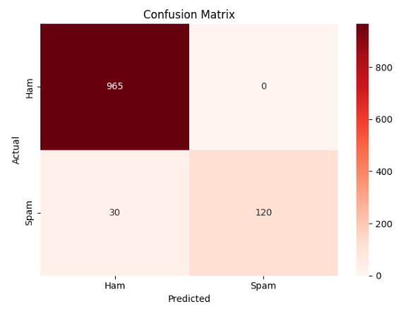

# Spam Email Classifier

A Machine Learning model that automatically detects whether an SMS/email
message is **spam or not spam (ham)** using NLP and Naive Bayes algorithm.

---

## Demo



---

## Tech Stack

| Tool | Purpose |
|------|---------|
| Python | Core language |
| Scikit-learn | ML model + evaluation |
| Pandas | Data loading & cleaning |
| TF-IDF Vectorizer | Text → Numbers conversion |
| Matplotlib / Seaborn | Visualization |

---

## 📁 Dataset

- **Name:** SMS Spam Collection Dataset
- **Source:** [Kaggle](https://www.kaggle.com/datasets/uciml/sms-spam-collection-dataset)
- **Size:** 5,572 messages (4,825 ham + 747 spam)

---

## How to Run

**1. Clone the repo**
git clone https://github.com/RadhikaKapoor383/spam-classifier.git
cd spam-classifier

**2. Install dependencies**
py -m pip install pandas numpy matplotlib seaborn scikit-learn

**3. Add the dataset**
Download spam.csv from Kaggle and place it in the project folder.

**4. Run the model**
python spam_classifier.py

---

## Results

| Metric    | Score  |
|-----------|--------|
| Accuracy  | 97.31% |
| Precision | 100%   |
| Recall    | 80%    |
| F1-Score  | 88.89% |

---

## What I Learned

- How to preprocess raw text data for ML
- What TF-IDF is and why it beats simple word counting
- Why Naive Bayes works well for text classification
- Difference between Accuracy, Precision, Recall, and F1-Score
- How to evaluate a model honestly using a confusion matrix

---

## 📂 Project Structure

```
spam-classifier/
│
├── spam_classifier.py
├── dataset/
│   └── spam.csv
├── confusion_matrix.png 
└── README.md
```

---

## Author

**Radhika kapoor**
<br>
🔗 [LinkedIn](https://www.linkedin.com/in/radhika-kumari2005/)
<br>
🐙 [GitHub](https://github.com/RadhikaKapoor383)
