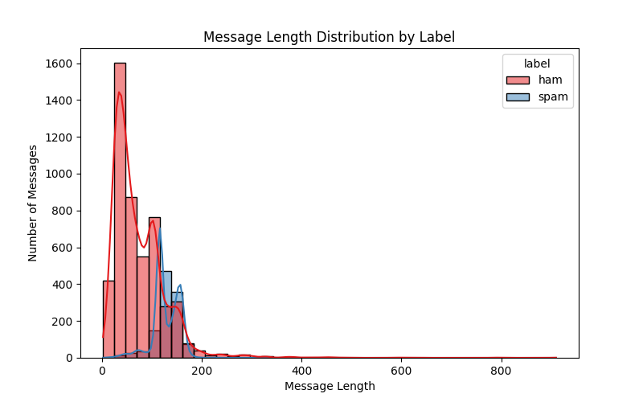
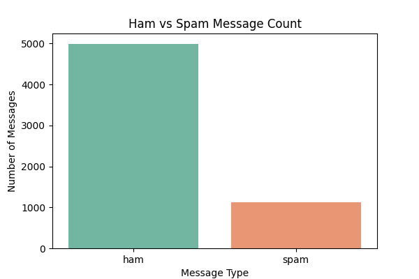

# Spam Email Classifier

A machine learning project that classifies SMS/email messages as **spam** or **ham** using Natural Language Processing, TF-IDF feature extraction, and a Multinomial Naive Bayes classifier.

---

## Project Overview

This project follows a complete machine learning workflow inside a Jupyter notebook. It starts with loading and cleaning the SMS Spam Collection Dataset, then performs exploratory data analysis, creates text-based features, preprocesses raw messages, trains a classification model, and evaluates the results using standard classification metrics.

---

## Demo





---

## Tech Stack

| Tool | Purpose |
|------|---------|
| Python | Core programming language |
| Jupyter Notebook | Project development and presentation |
| Pandas | Data loading, cleaning, and feature creation |
| Scikit-learn | Model training, TF-IDF vectorization, and evaluation |
| Matplotlib / Seaborn | Data visualization |
| Multinomial Naive Bayes | Spam classification model |

---

## Dataset

- **Name:** SMS Spam Collection Dataset
- **Source:** [Kaggle](https://www.kaggle.com/datasets/uciml/sms-spam-collection-dataset)
- **Original Size:** 5,572 messages
- **Current Project Dataset:** 6,540 messages after adding 1,000 extra sample messages
- **Labels:** `ham` for normal messages and `spam` for unwanted messages

The notebook also checks for missing values and duplicate messages. Duplicate messages are removed before model training to make the evaluation cleaner. This project version includes 10 additional ham examples and 10 additional spam examples for extra testing variety.

---

## Notebook Workflow

1. Import required libraries
2. Load and prepare the dataset
3. Check missing values and duplicate messages
4. Analyze ham vs spam label distribution
5. Visualize class imbalance
6. Create message-level features:
   - message length
   - word count
   - digit count
   - punctuation count
   - stop word count
7. Compare ham and spam message patterns
8. Clean and preprocess raw text
9. Encode labels into numerical values
10. Split data into training and testing sets
11. Convert cleaned text into TF-IDF features
12. Train a Multinomial Naive Bayes classifier
13. Predict labels on test data
14. Evaluate performance using:
   - accuracy
   - precision
   - recall
   - F1-score
   - classification report
15. Visualize the confusion matrix
16. Test the model with custom messages

---

## Feature Engineering

The project includes both exploratory and model-ready feature engineering.

For EDA, the notebook creates message statistics such as message length, word count, digit count, punctuation count, and stop word count. These features help compare spam and ham message behavior.

For model training, the notebook creates a cleaned text column called `clean_message`, then converts it into numerical TF-IDF features.

---

## Text Preprocessing

The notebook cleans message text by:

- converting text to lowercase
- removing URLs
- removing numbers
- removing punctuation and special characters
- removing extra spaces

The same preprocessing function is also used when predicting custom messages.

---

## How to Run

**1. Clone the repository**

```bash
git clone https://github.com/RadhikaKapoor383/spam-classifier.git
cd spam-classifier
```

**2. Install dependencies**

```bash
py -m pip install pandas numpy matplotlib seaborn scikit-learn notebook
```

**3. Add the dataset**

Place `spam.csv` inside:

```text
spam-classifier dataset/
```

**4. Open the notebook**

```bash
jupyter notebook spam_classifier.ipynb
```

Then run all cells from top to bottom.

---

## Results

The model is evaluated using accuracy, precision, recall, F1-score, a classification report, and a confusion matrix.

Note: After the latest EDA, duplicate removal, and text preprocessing updates, run the notebook from the beginning to refresh the final metric values.

---

## What I Learned

- How to load and clean a real-world text dataset
- How to check missing values and duplicate records
- How to perform EDA on text classification data
- How to create message-level features for analysis
- How to preprocess raw text for machine learning
- How TF-IDF converts text into numerical features
- Why Naive Bayes works well for spam classification
- How to evaluate a classification model using multiple metrics
- How to use a confusion matrix to understand model mistakes

---

## Project Structure

```text
spam-classifier/
|
|-- spam_classifier.ipynb
|-- confusion_matrix.png
|-- README.md
`-- spam-classifier dataset/
    `-- spam.csv
```

---

## Author

**Radhika Kapoor**

- [LinkedIn](https://www.linkedin.com/in/radhika-kumari2005/)
- [GitHub](https://github.com/RadhikaKapoor383)
